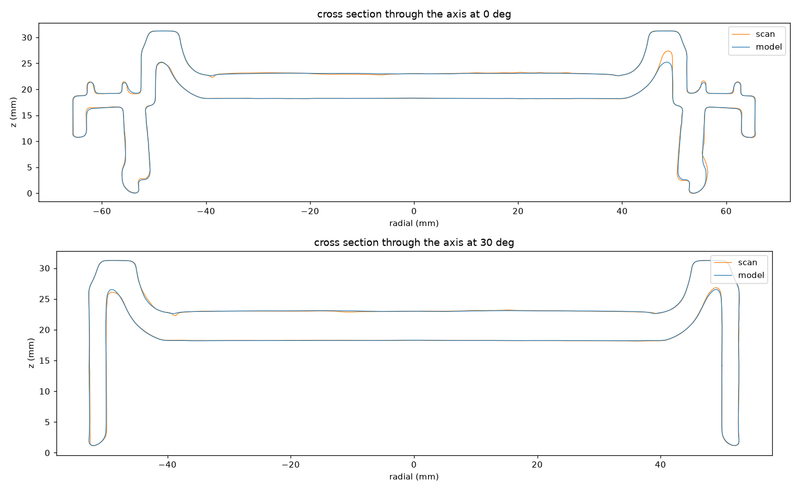
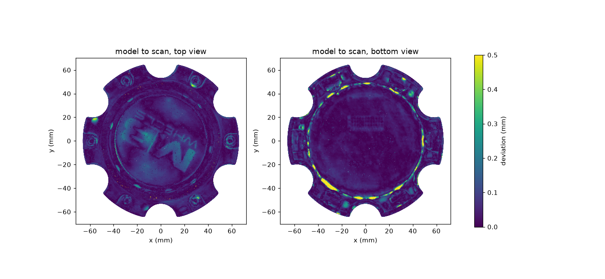
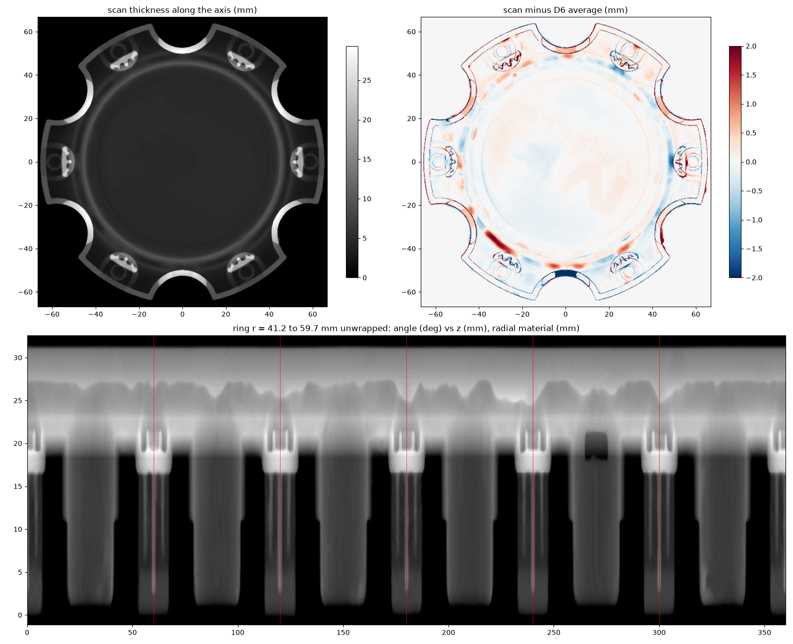

# MB Wheels center cap CAP5372-61397

A clean, printable STL of the MB Wheels 6-lug center cap, rebuilt from a 3D scan
(`Mesh_Gene.stl`) so its dimensions match the original part.

Output: [`wheel_cap_CAP5372.stl`](wheel_cap_CAP5372.stl) (millimeters, lowest point at z=0,
front face up, snap clips down).

## Measured from the scan

| feature | value |
|---|---|
| across bolt tabs | 131.1 mm |
| across lug notches | 127.9 mm |
| overall height | 31.4 mm |
| raised ring height | 11.25 mm |
| fake bolt bosses | 6, at 58.9 mm radius |
| snap clips | 6, extending 20 mm below the flange |
| solid volume | about 74,164 mm3 |
| "MB WHEELS" logo | 0.1 mm relief, left off (too shallow to print, and a trademark) |

## Pipeline

All steps run in `scripts/build_cap.py`:

1. **Align.** The cap axis comes from PCA of the surface and is refined with the
   normals of all flat faces. The front face points up, and the snap clips point down.
2. **Fit the symmetry.** The cap has D6 symmetry (6 rotations, 6 mirrors). The center
   and a mirror axis are fitted on a top-view thickness map, first coarse, then fine.
3. **Voxelize and symmetrize.** The scan is rasterized column by column at 0.15 mm, with
   exact fractional occupancy along z. This is done once for each of the 12 D6 transforms
   of the mesh, and the 12 fields are averaged. Because each transform is applied to
   the mesh itself, the field is never resampled. Scan noise and the logo, which
   appears in only one of the 12 images, average out.
4. **Mesh.** A light Gaussian blur (sigma 0.6 voxel) is applied, then marching cubes
   at 0.5, Taubin smoothing (10 passes), and decimation to about 400k faces.
5. **Export.** The lowest point goes to z=0 and watertightness is checked.
   `wheel_cap_CAP5372.build.json` records the transform from scan to model coordinates.

`scripts/verify.py` then compares the model with the aligned scan: two-way surface
deviation, extents, diameter, height, volume, and front-face flatness.

## Running it

In the cloud: the GitHub Actions workflow **Build wheel cap STL** runs on every push that
changes `wheel-cap/scripts/`, or manually from the Actions tab. It downloads the scan,
builds and verifies the STL, and commits the results back to `main`.

Locally:

```bash
pip install numpy scipy trimesh scikit-image matplotlib manifold3d fast_simplification rtree
bash wheel-cap/scripts/get_inputs.sh          # scan into wheel-cap/work/ (gitignored)
cd wheel-cap
python scripts/build_cap.py work/Mesh_Gene.stl --out wheel_cap_CAP5372.stl --work work
python scripts/verify.py wheel_cap_CAP5372.stl work/scan_aligned.stl --outdir verification
python scripts/update_readme.py
```

Options: `--res` (voxel size, default 0.15 mm), `--blur`, `--taubin`, `--faces`, and
`--flip` if the front/back detection ever picks the wrong side.

The pipeline was checked on a synthetic D6 cap with a known shape, a random pose,
and an asymmetric 0.1 mm logo. The rebuilt model deviated from the true shape by
0.014 mm mean and 0.047 mm at the 95th percentile. The logo was removed: the front
face spread was 0.04 mm on the model vs 0.15 mm on the scan.

## Verification against the scan

<!-- results:start -->
| metric | model | scan |
|---|---|---|
| extents | 131.10 x 127.75 x 31.25 mm | 131.38 x 127.88 x 31.45 mm |
| max diameter | 131.39 mm | 132.90 mm |
| height | 31.25 mm | 31.45 mm |
| volume | 74,017 mm3 | 74,164 mm3 |
| faces | 399,998 | 1,063,042 |
| watertight | True | True |

| surface deviation | mean | 95th pct | 99th pct | max |
|---|---|---|---|---|
| model to scan | 0.058 mm | 0.159 mm | 0.402 mm | 2.113 mm |
| scan to model | 0.057 mm | 0.162 mm | 0.400 mm | 2.166 mm |

Front face (top surface within r < 16.4 mm): model height spread 0.145 mm (std 0.041), scan 0.481 mm (std 0.103).






<!-- results:end -->

## Printing notes

The snap clips need some flex: PETG or ABS/ASA works better than PLA for a part that
sits on a wheel in the sun.
